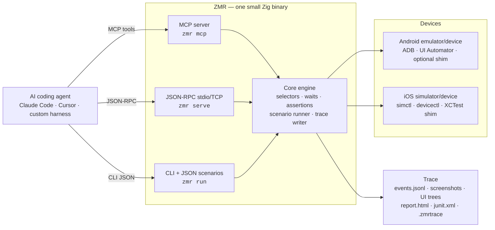
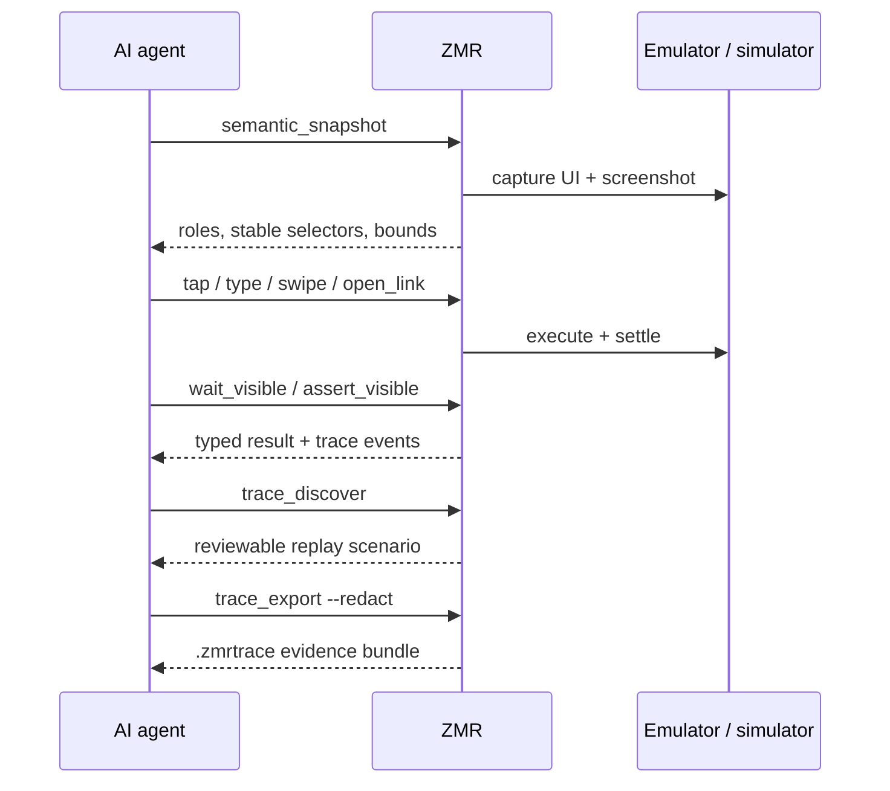

# Zeno Mobile Runner

> The verification loop for AI coding agents building Expo, React Native,
> Flutter, and native Android/iOS apps.

[](https://github.com/johnmikel/zeno-mobile-runner/actions/workflows/ci.yml)
[](https://github.com/johnmikel/zeno-mobile-runner/releases)
[](https://www.npmjs.com/package/zeno-mobile-runner)
[](LICENSE)

Your coding agent can write mobile code, but it cannot see the phone. ZMR is
its eyes and hands: a typed mobile control plane that installs and launches
apps, observes the UI, taps and types, waits for the screen to settle, asserts
state, and exports a replayable trace as proof. The runner does not embed an
LLM. Agents stay outside and drive ZMR through MCP, JSON-RPC, CLI JSON, or
JSON scenarios.


<p align="center">
  
  &nbsp;&nbsp;
  
</p>

<p align="center"><em>Real on-device screenshots from ZMR traces: the same demo flow
driven on an iOS simulator and an Android emulator.</em></p>

## Why agents need this

- **Agents can't verify what they can't observe.** ZMR returns semantic UI
  trees with stable selectors, screenshots, and typed action results an agent
  can reason about — not raw pixels it has to guess at.
- **Evidence, not vibes.** Every session can write a deterministic trace:
  events, screenshots, UI hierarchies, timings, assertion results, HTML and
  JUnit reports, and a redacted shareable bundle.
- **Tests fall out for free.** After a live agent session, `zmr discover`
  turns the trace into a reviewable JSON scenario that replays in CI without
  an LLM in the loop.

## How it works



No app instrumentation is required on Android. iOS selector actions use an
app-local XCTest shim that the wizard scaffolds. ZMR works below the
JavaScript/Dart layer, so React Native, Expo, Flutter, and fully native apps
are all driven the same way. See [docs/frameworks.md](docs/frameworks.md).

## Five-minute start

Inside a mobile app repo:

```bash
npm install --save-dev zeno-mobile-runner   # bun add --dev zeno-mobile-runner
npx zmr-wizard --app-id com.example.mobiletest --package-json
npx zmr doctor --strict --json --config .zmr/config.json
```

Hook it up to your coding agent (Claude Code shown; any MCP client works):

```bash
claude mcp add zmr -- npx zmr mcp --config .zmr/config.json --trace-dir traces/zmr-agent
```

Claude Code users can instead install the plugin, which bundles the MCP server
and a mobile-testing skill:

```text
/plugin marketplace add johnmikel/zeno-mobile-runner
/plugin install zmr@zmr-marketplace
```

Or in an `.mcp.json` / MCP client config:

```json
{
  "mcpServers": {
    "zmr": {
      "command": "npx",
      "args": ["zmr", "mcp", "--config", ".zmr/config.json", "--trace-dir", "traces/zmr-agent"]
    }
  }
}
```

Then ask the agent to verify its own work: *"launch the app, walk through
onboarding, and show me the trace."*

## The agent verification loop



The MCP server exposes the full loop as mobile-native tools:

| Group | Tools |
| --- | --- |
| Observe | `snapshot`, `semantic_snapshot` |
| App lifecycle | `install_app`, `launch_app`, `stop_app`, `clear_state`, `open_link` |
| Act | `tap`, `type`, `erase_text`, `hide_keyboard`, `swipe`, `press_back` |
| Wait | `wait_visible`, `wait_not_visible`, `wait_any`, `scroll_until_visible` |
| Assert | `assert_visible`, `assert_not_visible`, `assert_healthy` |
| Evidence | `trace_events`, `trace_explain`, `trace_discover`, `trace_explore`, `trace_export`, `scenario_validate` |

The same surface is available over JSON-RPC for harnesses that embed ZMR
directly — see [docs/protocol.md](docs/protocol.md) and
[docs/ai-agents.md](docs/ai-agents.md). When a run fails, `zmr explain`
diagnoses the trace for humans and agents alike:


## Deterministic scenarios for CI

Scenarios are plain JSON — agents and build scripts generate, validate, and
mutate them without a second DSL, and they replay in CI with no LLM cost:

```json
{
  "name": "Login smoke",
  "appId": "com.example.mobiletest",
  "steps": [
    { "action": "clearState" },
    { "action": "launch" },
    { "action": "assertHealthy", "timeoutMs": 5000 },
    { "action": "tap", "selector": { "resourceId": "email" } },
    { "action": "typeText", "text": "user@example.com" },
    { "action": "tap", "selector": { "text": "Login" } },
    { "action": "waitVisible", "selector": { "text": "Welcome" }, "timeoutMs": 30000 }
  ]
}
```

```bash
zmr validate --json .zmr/login-smoke.json
zmr run .zmr/login-smoke.json --json --trace-dir traces/login-smoke
zmr report traces/login-smoke --out traces/login-smoke/report.html --junit traces/login-smoke/junit.xml
zmr export traces/login-smoke --out login-smoke-redacted.zmrtrace --redact
```

Traced `zmr run --json` responses include executable `nextCommands` so agents
can continue to reporting, explanation, discovery, or export without guessing.
Open any exported bundle in the static [trace viewer](viewer/index.html) — or
serve it and link straight to it with `viewer/index.html?bundle=<url>`.

For repeat-run reliability gates, p95 duration thresholds, baseline
comparisons against your current E2E tool, and multi-device matrices, see
[docs/benchmarking.md](docs/benchmarking.md) and the public
[Benchmark Lab](docs/benchmarks/README.md) evidence.

## Platform support

| Target | Status | Notes |
| --- | --- | --- |
| Android emulator | Supported | ADB/UI Automator, optional Android shim, emulator lifecycle helpers |
| Android physical device | Supported | Requires ADB connection and app build/install surface |
| iOS simulator | Supported | `simctl` plus app-local XCTest/XCUIAutomation shim for native selector actions |
| iOS physical device | Supported, validate locally | `devicectl` lifecycle plus XCTest shim; pilot on your own app/device before relying on it in CI |
| Cloud device farms | Not included | ZMR focuses on local and self-managed device targets in this preview |

Slow CI hardware can extend the iOS shim cold-build timeout with
`ZMR_IOS_SHIM_TIMEOUT_MS`. Current release: `0.2.10` developer preview.
Protocol version: `2026-04-28`.

## Optional protocol clients

TypeScript and Python clients are the common starting points; Go, Rust, Swift,
and Kotlin reference clients embed the same JSON-RPC protocol from those
ecosystems. All are thin wrappers around `zmr serve --transport stdio`. See
[docs/clients.md](docs/clients.md) and
[docs/client-installation.md](docs/client-installation.md).

## Documentation

**For agents**

- [docs/ai-agents.md](docs/ai-agents.md): JSON-RPC and MCP agent workflows
- [docs/agent-discovery.md](docs/agent-discovery.md): agent-led discovery, `zmr explore`/`discover`/`draft`, and the trace-to-test loop
- [skills/zmr-mobile-testing/SKILL.md](skills/zmr-mobile-testing/SKILL.md): reusable agent skill

**For test authors**

- [docs/install.md](docs/install.md): source, npm, Homebrew, and app setup
- [docs/frameworks.md](docs/frameworks.md): React Native, Expo, Flutter, and native app guidance
- [docs/scenario-authoring.md](docs/scenario-authoring.md): selectors, waits, and scenario design
- [docs/app-integration.md](docs/app-integration.md): app-side Android/iOS shims
- [docs/expo-smoke.md](docs/expo-smoke.md): reproducible Expo and iOS smoke test
- [docs/benchmarking.md](docs/benchmarking.md): repeat-run gates, reports, device matrix, baselines

**Reference**

- [FEATURES.md](FEATURES.md): complete feature list and limitations
- [docs/protocol.md](docs/protocol.md): JSON-RPC methods and schemas
- [docs/trace-privacy.md](docs/trace-privacy.md): safe trace export
- [docs/production-readiness.md](docs/production-readiness.md): release, reliability, and agent-readiness gates
- [docs/troubleshooting.md](docs/troubleshooting.md): common setup and runtime issues
- [docs/benchmarks](docs/benchmarks/README.md): public-safe benchmark evidence

## License

MIT
