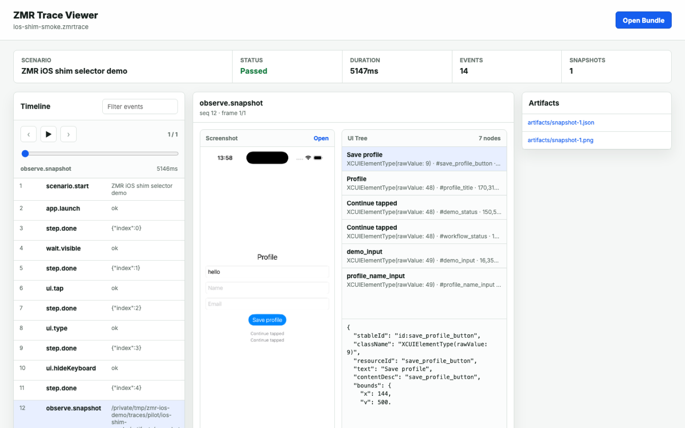
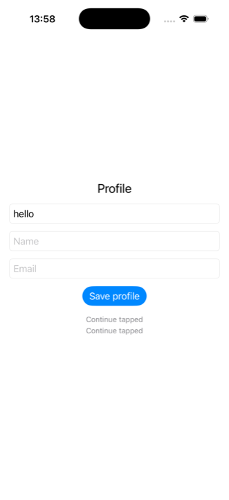
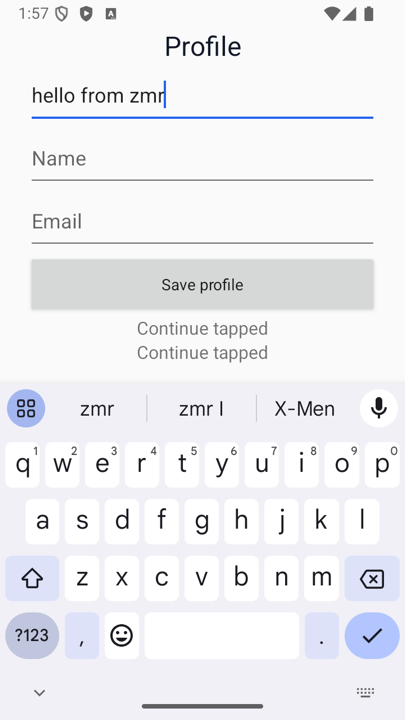
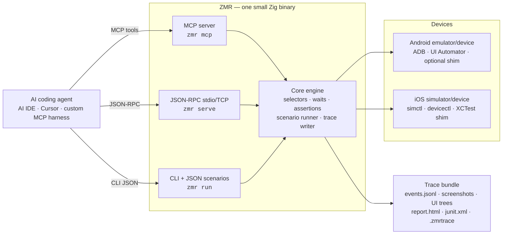
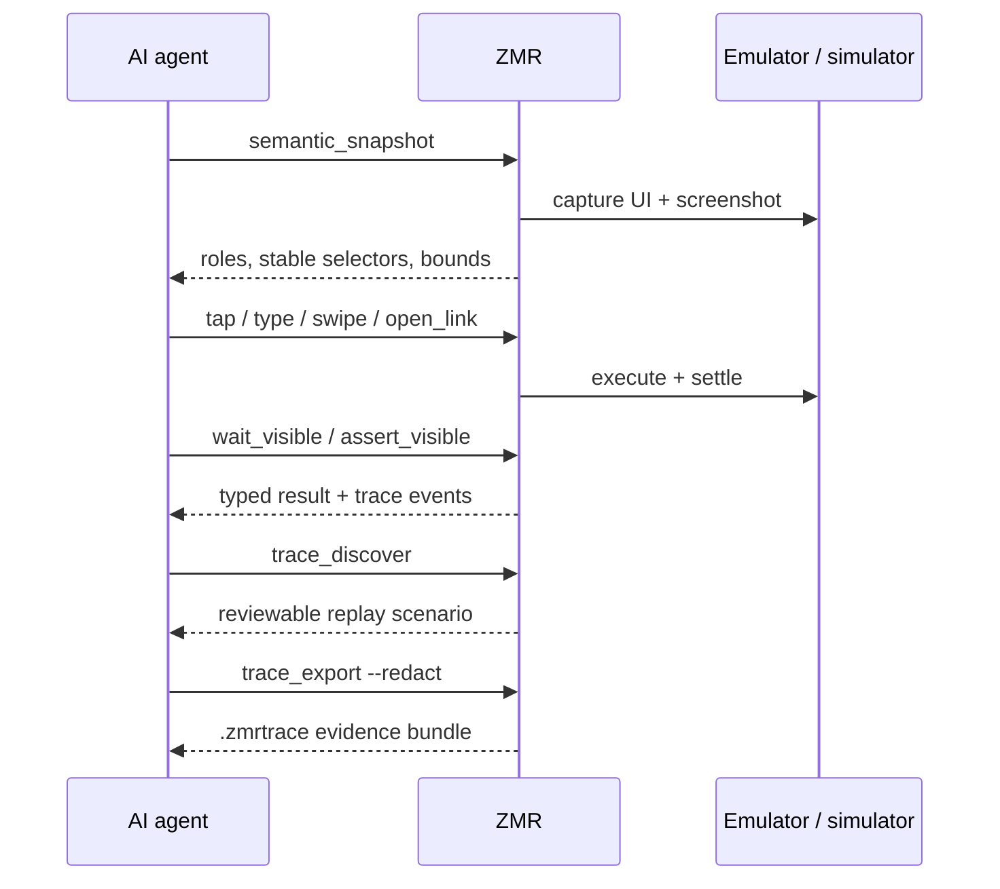
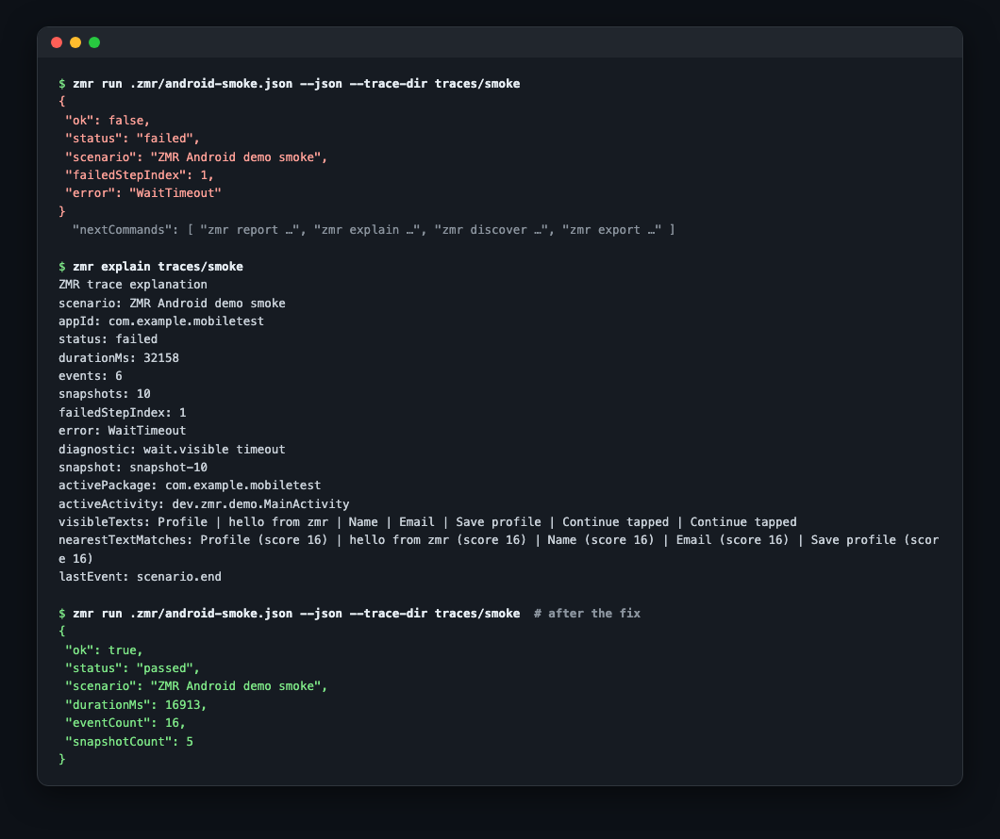

# Zeno Mobile Runner

> Did your AI agent's last change break the app? ZMR gives you a deterministic
> yes or no — on a real iOS or Android device, with replayable evidence, and no
> LLM in the loop.

[](https://github.com/johnmikel/zeno-mobile-runner/actions/workflows/ci.yml)
[](https://www.npmjs.com/package/zeno-mobile-runner)
[](https://github.com/johnmikel/zeno-mobile-runner/releases)
[](LICENSE)

**Mobile UI automation built for AI coding agents.**

AI coding agents change mobile apps fast, but nothing tells them whether the UI
still works. Zeno Mobile Runner (ZMR) is that check: one small Zig binary that
installs and launches your app on a real device or simulator, runs a saved
scenario, and returns a typed pass/fail plus a replayable trace — screenshots,
UI trees, timings, assertion results.

Because there is **no LLM inside ZMR**, the same check costs nothing per run and
gives the same answer every time. Run it in your agent's loop and in CI. ZMR
drives native UI beneath the JavaScript and Dart layers, so React Native, Expo,
Flutter, and fully native apps share one runner — over MCP, JSON-RPC, a
JSON-output CLI, or committed JSON scenarios.



<p align="center">
  
  &nbsp;&nbsp;
  
</p>

<p align="center"><em>On-device screenshots from ZMR traces: the same demo flow
driven on an iOS simulator and an Android emulator.</em></p>

## Why This Exists

- **Agents need structured mobile state, not terminal scrapings.** ZMR returns
  semantic UI trees, stable selectors, screenshots, and typed action results, so
  an agent reasons from product state instead of guessing.
- **Product claims need evidence.** Every traced session can produce events,
  screenshots, UI hierarchies, timings, assertion results, HTML and JUnit
  reports, and a redacted bundle safe to share.
- **Exploration should become tests.** After a live agent session,
  `zmr discover` / `draft` turn trace evidence into reviewable JSON scenarios
  that replay in CI with no LLM in the loop — and no per-run LLM cost.
- **One model below the framework layer.** ZMR drives native UI beneath the
  JavaScript and Dart layers, so React Native, Expo, Flutter, and fully native
  apps share the same runner, selectors, and traces.

## How it works



One core engine, four driver surfaces, two device backends:

- **Core engine (Zig).** Selector resolution, waits, assertions, the scenario
  runner, and the trace writer live in one place and behave identically no matter
  which surface invoked them.
- **Four surfaces, one contract.** The MCP server (`zmr mcp`), JSON-RPC over
  stdio/TCP (`zmr serve`), the JSON-output CLI (`zmr run` / `validate` /
  `explain` / `discover`), and committed JSON scenarios all map onto the same
  engine and the same versioned schemas.
- **Android backend.** Real ADB and UI Automator (`exec-out uiautomator dump`,
  `screencap`) with no app instrumentation required; an optional app-local Java
  instrumentation shim speeds up native actions when you build it in.
- **iOS / iPadOS backend.** `xcrun simctl` and `devicectl` handle lifecycle; a
  generated XCTest / XCUIAutomation Swift shim, scaffolded into your app,
  performs native selector actions.

A standout capability is the **trace-to-test loop**: drive the app live with an
agent, then run `zmr discover` / `draft` / `explore` to convert the captured
trace into a reviewable, schema-validated replay scenario that runs in CI with no
LLM involved.

See [docs/protocol.md](docs/protocol.md), [docs/ai-agents.md](docs/ai-agents.md),
and [docs/frameworks.md](docs/frameworks.md).

## Install

ZMR is designed to run from your mobile app repository. The curl path downloads
the native `zmr` binary and verifies it against the release `SHA256SUMS`; it then
prints the recommended next steps, which scaffold app-local config (`zmr init`)
and verify the toolchain (`zmr doctor`):

```bash
curl -fsSL https://raw.githubusercontent.com/johnmikel/zeno-mobile-runner/main/install.sh | sh
export PATH="$HOME/.local/bin:$PATH"
zmr init --app --app-id com.example.mobiletest
zmr doctor --strict --json --config .zmr/config.json
```

JavaScript teams can pin ZMR inside the app repo via npm and generate npm
scripts with the wizard:

```bash
npm install --save-dev zeno-mobile-runner
npx zmr-wizard --app-id com.example.mobiletest --package-json
```

A Homebrew path is also documented (generate a formula, then install the native
binary). See [docs/install.md](docs/install.md).

## Usage

### As an MCP server for a coding agent

Point any MCP-capable client at the local binary:

```bash
zmr mcp --config .zmr/config.json --trace-dir traces/zmr-agent
```

Or wire it into an `.mcp.json` / MCP client config:

```json
{
  "mcpServers": {
    "zmr": {
      "command": "zmr",
      "args": ["mcp", "--config", ".zmr/config.json", "--trace-dir", "traces/zmr-agent"]
    }
  }
}
```

Then ask the agent to verify its own work: *"launch the app, walk through
onboarding, and show me the trace."* The MCP server exposes the full loop as
26 mobile-native tools:

| Group | Tools |
| --- | --- |
| Observe | `snapshot`, `semantic_snapshot` |
| App lifecycle | `install_app`, `launch_app`, `stop_app`, `clear_state`, `open_link` |
| Act | `tap`, `type`, `erase_text`, `hide_keyboard`, `swipe`, `press_back` |
| Wait | `wait_visible`, `wait_not_visible`, `wait_any`, `scroll_until_visible` |
| Assert | `assert_visible`, `assert_not_visible`, `assert_healthy` |
| Evidence | `trace_events`, `trace_explain`, `trace_discover`, `trace_explore`, `trace_export`, `scenario_validate` |

## Agent Verification Loop



A parallel JSON-RPC method set (`runner.capabilities`, `device.list`,
`session.create`, `observe.*`, `ui.*`, `trace.*`, `scenario.*`) exposes the same
engine to harnesses that embed ZMR over stdio or TCP.

When a run fails, `zmr explain` diagnoses the trace for humans and agents alike:



## Deterministic Scenarios For CI

Scenarios are plain JSON — no second DSL to learn. Agents and build scripts can
generate, validate, and mutate them, then replay them in CI with no LLM cost:

```json
{
  "name": "Login smoke",
  "appId": "com.example.mobiletest",
  "steps": [
    { "action": "clearState" },
    { "action": "launch" },
    { "action": "assertHealthy", "timeoutMs": 5000 },
    { "action": "tap", "selector": { "resourceId": "email" } },
    { "action": "typeText", "text": "user@example.com" },
    { "action": "tap", "selector": { "text": "Login" } },
    { "action": "waitVisible", "selector": { "text": "Welcome" }, "timeoutMs": 30000 }
  ]
}
```

```bash
zmr validate --json .zmr/login-smoke.json
zmr run .zmr/login-smoke.json --json --trace-dir traces/login-smoke
zmr report traces/login-smoke --out traces/login-smoke/report.html --junit traces/login-smoke/junit.xml
zmr export traces/login-smoke --out login-smoke-redacted.zmrtrace --redact
```

Traced `zmr run --json` responses carry executable `nextCommands`, so an agent
can continue to reporting, explanation, discovery, or export without
reconstructing paths from text. When a run fails, `zmr explain` diagnoses the
trace for humans and agents alike. Open any exported bundle in the static
[trace viewer](viewer/index.html), or serve it and deep-link with
`viewer/index.html?bundle=<url>`.

For repeat-run reliability gates (pass-rate, failure-count, p95 duration),
device matrices, and baseline comparison, see
[docs/benchmarking.md](docs/benchmarking.md). Benchmark fixtures shipped in the
repo are generic — gather your own app/device evidence before making performance
claims.

## Reference clients

Thin JSON-RPC wrappers ship for **TypeScript, Python, Go, Rust, Swift, and
Kotlin**, each with its own tests. They are optional — all of them call
`zmr serve --transport stdio` and speak the same protocol. TypeScript and Python
are the usual starting points. See [docs/clients.md](docs/clients.md) and
[docs/client-installation.md](docs/client-installation.md).

## Release evidence (mobile + web)

Zeno turns completed ZMR and Playwright runs into one open,
digest-verifiable Evidence Contract. It preserves what ran, against which exact
build, what passed or failed, and which business journey it supports. See the
[Evidence Contract guide](docs/evidence-contract.md).

## Platform support

| Target | Status | Notes |
| --- | --- | --- |
| Android emulator | Supported | ADB / UI Automator, optional Android shim, emulator lifecycle helpers |
| Android physical device | Supported | Requires ADB connection and an app build/install surface |
| iPhone simulator | Supported | `simctl` plus app-local XCTest / XCUIAutomation shim for native selector actions |
| iPad simulator | Supported, evidence-needed | Same iOS simulator path; validate tablet layouts and size-class branches before production claims |
| iPhone physical device | Supported, validate locally | `devicectl` lifecycle plus XCTest shim; pilot on your app/device before relying on it in CI |
| iPad physical device | Supported, evidence-needed | Same iOS / iPadOS physical path; collect separate iPad pilot evidence first |
| Apple TV / Apple Watch | Not in this preview | Would require a separate platform lifecycle, shim, destination, and trace evidence |
| Cloud device farms | Not included | ZMR targets local and self-managed devices in this preview |

Slow CI hardware can extend the generated iOS shim build timeout with
`ZMR_IOS_SHIM_BUILD_TIMEOUT_SECONDS`; `ZMR_IOS_SHIM_RESPONSE_TIMEOUT_SECONDS`
bounds each in-flight request, and `ZMR_IOS_SHIM_TIMEOUT_MS` remains the outer
process ceiling. Current release: `0.2.17` developer preview.

End-to-end device runs require a configured mobile toolchain (Android SDK / ADB,
Xcode / `simctl`) and, for iOS native selector actions, building the generated
XCTest shim into the app. To exercise the engine **without hardware**, the repo
ships fake-device test doubles (`fake-adb`, `fake-xcrun`, fake shims) used
throughout the test suite and the `zmr validate examples/demo-fake.json` demo.

## Project status

ZMR is a **0.2.x developer preview** (runner version `0.2.17`, protocol version
`2026-04-28`), [published to npm](https://www.npmjs.com/package/zeno-mobile-runner)
with curl / npm / Homebrew install paths. There is no 1.0 stability guarantee
yet, and surfaces may change between minor versions.

What backs that maturity claim:

- **Tested.** ~16.5k lines of non-test Zig across 78 non-test source files (141
  `.zig` files in `src/` including tests), with 284 in-source Zig `test` blocks,
  plus a `tests/` directory of 68 shell / Node / Python script tests (a few of
  which are fake-device doubles). `build.zig` wires three test targets (unit,
  iOS, runner).
- **CI.** Three GitHub Actions workflows: `ci.yml` (builds Zig and runs the
  cross-language client tests on macOS), `device-smoke.yml` (nightly cron that
  boots a real Android emulator and iOS simulator end-to-end), and `release.yml`
  (tagged release that builds the dist bundle, attests artifacts, and publishes
  to npm).
- **Contracts.** 24 published JSON Schemas covering scenarios, snapshots, action
  results, trace events, protocol messages, and command outputs.
- **Supply chain.** The release pipeline generates an SPDX SBOM and
  `SHA256SUMS`, and attaches build provenance attestation via `actions/attest`.
  (macOS code-signing/notarization scripts exist in `scripts/` but are not yet
  wired into the release workflow; npm publish does not currently set
  `--provenance`.)
- **Distribution.** Also shipped with an agent plugin bundle (`.claude-plugin/`)
  and registered as an MCP server (`glama.json`).

Some Apple-platform and benchmark claims are honestly marked *evidence-needed* in
the support matrix; redaction is intentionally conservative. See
[FEATURES.md](FEATURES.md), [CHANGELOG.md](CHANGELOG.md),
[SECURITY.md](SECURITY.md), and
[docs/production-readiness.md](docs/production-readiness.md) for the full picture.

## Documentation

- [docs/install.md](docs/install.md) — install paths and first setup checks
- [docs/ai-agents.md](docs/ai-agents.md) — JSON-RPC and MCP agent workflows
- [docs/agent-discovery.md](docs/agent-discovery.md) — `explore` / `discover` /
  `draft` and the trace-to-test loop
- [docs/scenario-authoring.md](docs/scenario-authoring.md) — selectors, waits,
  and scenario design
- [docs/frameworks.md](docs/frameworks.md) — React Native, Expo, Flutter, native
- [docs/expo-smoke.md](docs/expo-smoke.md) — reproducible Expo and iOS smoke test
- [docs/support-matrix.md](docs/support-matrix.md) — platform support and evidence levels
- [docs/protocol.md](docs/protocol.md) — JSON-RPC methods and schemas
- [docs/trace-privacy.md](docs/trace-privacy.md) — safe trace export
- [docs/troubleshooting.md](docs/troubleshooting.md) — common setup and runtime
  issues
- [skills/zmr-mobile-testing/SKILL.md](skills/zmr-mobile-testing/SKILL.md) — reusable agent testing workflow
- [FEATURES.md](FEATURES.md) — complete feature list and limitations

## License

MIT © John Mikel Regida — see [LICENSE](LICENSE).
