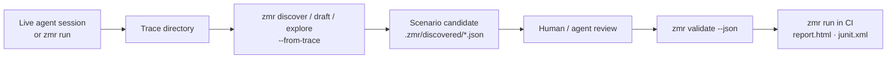

# Scenario Authoring

ZMR scenarios are JSON so agents, code generators, and CI scripts can create
and mutate them without learning another DSL. The parser is strict: validate
before a device run, keep flows explicit, and bias selectors toward app-owned
identifiers.

Scenarios can be written by hand or generated review-first from the trace of a
live session:



## Selector Strategy

Prefer selectors in this order for committed scenarios:

1. `id` or `resourceId` for app-owned controls.
2. `contentDesc` for intentional accessibility labels.
3. Exact `text` for stable product copy.
4. `textContains` only for headings, errors, or partial copy that is expected to
   vary.
5. `stableId` only as a fallback copied from the current `semantic_snapshot`
   when no app-owned selector exists.

Avoid selecting by text that includes user data, timestamps, counts, prices, or
network-provided content. Prefer app-owned resource ids or accessibility identifiers
over widening a selector until it matches unrelated nodes.
Treat `stableId` as a live-session fallback: it can unblock immediate agent
actions, but committed CI scenarios should prefer app-owned selectors because UI
tree shape and fallback IDs can change as layouts evolve.

Beyond the identity fields above, selectors can narrow a match with:

- State fields: `enabled`, `checked`, `focused`, `selected` (booleans).
- `index` to pick the nth node when several match.
- Bounded-regex fields: `textRegex`, `contentDescRegex` — a deterministic
  subset supporting literals, `.`, `*`, `^`, `$`, and backslash escapes.
  Unsupported constructs simply produce no match; they never fall back to
  substring matching.
- Relational anchors: `above`, `below`, `leftOf`, `rightOf` (spatial), and
  `child` / `descendant` (hierarchy), each taking a nested selector for the
  anchor node.

  **`child` and `descendant` are Android-only today.** They rely on parent
  links, which the Android hierarchy parser produces from the nesting
  `uiautomator` reports. The iOS shim enumerates elements by type rather than
  walking the tree, so no parent information reaches the runner and hierarchy
  anchors match nothing there. Spatial anchors work on both platforms.

Use relational anchors sparingly in committed scenarios — they encode layout,
which changes more often than app-owned identifiers do.

## Waits And Assertions

Use a wait before actions that depend on navigation, network, or app state:

```json
{ "action": "waitVisible", "selector": { "id": "email-login-submit-button" }, "timeoutMs": 15000 }
```

Use assertions for product expectations, not for synchronization that is already
covered by a wait. Prefer `waitAny` when either of two legitimate states can
appear, such as an already-authenticated dashboard or a sign-in prompt.

Add `assertHealthy` after launch, deep links, and major navigation steps to
fail on common mobile crash overlays and development-server error screens that
can coexist with otherwise valid UI:

```json
{ "action": "assertHealthy" }
```

Use `assertNoneVisible` when a flow needs app-specific negative assertions that
are not part of ZMR's built-in health guard.

## Optional And Recovery Steps

Use `"optional": true` only for dismissals or recovery actions that are not part
of the required product behavior:

```json
{ "action": "tap", "selector": { "textContains": "Not now" }, "optional": true }
```

Optional steps still emit trace events, so failures remain inspectable without
making the whole flow flaky.

## Importing Existing Flows

Use the importer as a one-time migration helper when evaluating ZMR against an
existing mobile-flow YAML suite:

```bash
zmr import flow-yaml flows/login.yaml --out .zmr/login-smoke.json --json
zmr validate .zmr/login-smoke.json
```

The importer supports the common subset needed for smoke scenarios:
`launchApp` (including launch arguments), `stopApp`, `killApp`/`forceStop`,
`clearState`/`clearAppState`, `clearKeychain`, `tapOn`, `longPressOn`,
`doubleTapOn`, `pressKey`, `inputText`, `eraseText`, `hideKeyboard`,
`copyText`/`setClipboard`, `grantPermissions`, `setOrientation`,
`assertVisible`, `assertNotVisible`, `openLink`, `back`/`pressBack`,
`scrollUntilVisible`, `takeScreenshot`, `runFlow` (nested flows are inlined
with a bounded depth), `repeat`, `retry`, `whenVisible`/`whenNotVisible`, and
the `waitUntilVisible`/`waitUntilNotVisible`/`waitForAnimationToEnd` wait
commands. Review the generated JSON before committing it. Native
`.zmr/*.json` scenarios remain the runtime contract for agents and CI.

Pass `--report <compatibility.json>` to write a per-command migration report —
each source command's status (`supported`, `rewritten`, or `unsupported`) with
its source line and column, so a large suite can be triaged file by file. Pass
`--strict` to exit non-zero when any command is unsupported, which makes
migration CI-gateable.

Use `setLocation` before location-dependent assertions to set simulator or
emulator coordinates through the runner instead of shelling out from the app
test:

```json
{ "action": "setLocation", "latitude": 51.5074, "longitude": -0.1278 }
```

On iOS simulators, ZMR grants the target app location permission before setting
the coordinate. On Android emulators, ZMR grants runtime location permissions
best-effort and then uses emulator geolocation.

`assertVisible` and `assertNotVisible` accept the same `timeoutMs` field as
waits when a scenario needs assertion-specific timing.

## Device And App Control Actions

Beyond the core lifecycle steps, scenarios can drive device and app state
directly:

- `killApp` (alias `forceStop`) — force-stop without clearing state.
- `clearKeychain` — reset iOS keychain entries for the target app (no-op
  driver-side on Android).
- `grantPermissions` — grant runtime permissions up front:
  `{ "action": "grantPermissions", "permissions": ["android.permission.CAMERA"] }`.
- `setOrientation` — `portrait` or `landscape`.
- `setClipboard` (alias `copyText`) — seed the clipboard before a paste flow.
- `launch` accepts typed `arguments` (string, number, or boolean values) passed
  to the app process on both platforms.

## Gestures And Keys

- `longPress` / `longPressOn` — long-press a selector target.
- `doubleTap` / `doubleTapOn` — double-tap a selector target.
- `pressKey` — send a named key (for example `enter`, `back`, `home`).

## Flow Composition

- `whenVisible` / `whenNotVisible` — run a nested block only if a selector is
  (not) on screen.
- `retry` — retry a nested block up to `times` attempts.
- `repeat` — run a nested block a fixed number of times.
- `runFlow` — inline the steps of another scenario file by path; nesting depth
  is bounded so cycles fail validation instead of recursing forever.
- `sleep` (alias `waitForAnimationToEnd`) — prefer explicit waits; reserve
  sleeps for animation settling.

The scenario root also accepts reserved metadata fields — `env`, `constants`,
`labels`, and `source` — which validate against the schema but are not yet
interpreted by the runner. Treat them as annotations for tooling.

## Example Templates

The example directory includes templates for common app flows:

- `examples/android-app-auth-probe.json`
- `examples/android-app-login-smoke.json`
- `examples/android-app-onboarding.json`
- `examples/android-app-referral-deep-link.json`
- `examples/android-app-error-state.json`
- `examples/android-workflow.json`
- `examples/ios-dev-client-open-link.json`
- `examples/ios-dev-client-route-snapshot.json`
- `examples/ios-shim-workflow.json`

Run `zmr validate --json <scenario.json>` before touching a device. Invalid
scenarios report `fieldPath`, `line`, and `column` when ZMR can identify the
source location. Unknown root, step, and selector fields are rejected so typos do
not silently change test intent.
