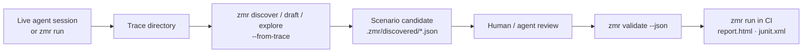

# Scenario Authoring

ZMR scenarios are JSON so agents can generate and mutate them without a second
DSL. JSON is strict, schema-validatable, and easy for agents and code generators
to emit. Keep scenarios explicit, short, and biased toward stable selectors.

Scenarios can be written by hand, or generated review-first from the trace of
a live session:



## Selector Strategy

Prefer selectors in this order:

1. `id` or `resourceId` for app-owned controls.
2. `contentDesc` for intentional accessibility labels.
3. Exact `text` for stable product copy.
4. `textContains` only for headings, errors, or partial copy that is expected to
   vary.

Avoid selecting by text that includes user data, timestamps, counts, prices, or
network-provided content. Prefer app-owned resource ids or accessibility identifiers
over widening a selector until it matches unrelated nodes.

## Waits And Assertions

Use a wait before actions that depend on navigation, network, or app state:

```json
{ "action": "waitVisible", "selector": { "id": "email-login-submit-button" }, "timeoutMs": 15000 }
```

Use assertions for product expectations, not for synchronization that is already
covered by a wait. Prefer `waitAny` when either of two legitimate states can
appear, such as an already-authenticated dashboard or a sign-in prompt.

Add `assertHealthy` after launch, deep links, and major navigation steps to
fail on common mobile crash overlays and development-server error screens that
can coexist with otherwise valid UI:

```json
{ "action": "assertHealthy" }
```

Use `assertNoneVisible` when a flow needs app-specific negative assertions that
are not part of ZMR's built-in health guard.

## Optional And Recovery Steps

Use `"optional": true` only for dismissals or recovery actions that are not part
of the required product behavior:

```json
{ "action": "tap", "selector": { "textContains": "Not now" }, "optional": true }
```

Optional steps still emit trace events, so failures remain inspectable without
making the whole flow flaky.

## Importing Existing Flows

Use the importer as a one-time migration helper when evaluating ZMR against an
existing mobile-flow YAML suite:

```bash
zmr import flow-yaml flows/login.yaml --out .zmr/login-smoke.json --json
zmr validate .zmr/login-smoke.json
```

The importer supports the common subset needed for smoke scenarios:
`launchApp`, `stopApp`, `clearState`, `tapOn`, `inputText`, `eraseText`,
`hideKeyboard`, `assertVisible`, `assertNotVisible`, `assertHealthy`,
`openLink`, `back`,
`scrollUntilVisible`, `takeScreenshot`, and simple wait commands. Review the
generated JSON before committing it; native `.zmr/*.json` scenarios remain the
runtime contract for agents and CI.

`assertVisible` and `assertNotVisible` accept the same `timeoutMs` field as
waits when a scenario needs assertion-specific timing.

## Example Templates

The example directory includes templates for common app flows:

- `examples/android-app-auth-probe.json`
- `examples/android-app-login-smoke.json`
- `examples/android-app-onboarding.json`
- `examples/android-app-referral-deep-link.json`
- `examples/android-app-error-state.json`
- `examples/android-workflow.json`
- `examples/ios-dev-client-open-link.json`
- `examples/ios-dev-client-route-snapshot.json`
- `examples/ios-shim-workflow.json`

Run `zmr validate --json <scenario.json>` before touching a device. Invalid
scenarios report `fieldPath`, `line`, and `column` when ZMR can identify the
source location.
